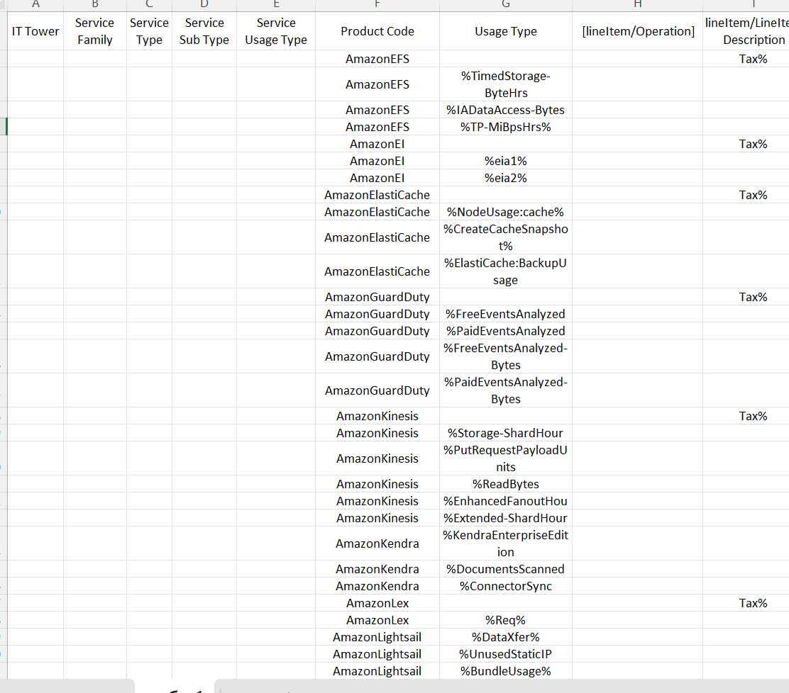

# Лабораторная работа №2 (AWS)

### Цель работы

Освоение облачных сервисов, углубленное изучение уровней абстракции инфраструктуры в облаке, формирование понимания различных моделей потребления сервисов и сравнение этих сервисов между разными провайдерами для более эффективной оценки возможности перехода на отечественные платформы.

### Перенос .csv файла в формат excel

### Классификация сервисов 

Нам было предложено несколько столбцов в EXCEL для распределения сервисов по нескольким параметрам. Расмотрим, что за что отвечает.

| Параметр | Описание |
| ----- | ------------ |
| **IT Tower** | Ответственная за управление инфраструктурой, обеспечение поддержки и анализ характеристик сервиса группа.`Storage`,` Machine Learning`, `DatabaseYandex`, `Cloud Apps` и т.д |
| **Service Family** | Это кластер сервисов, предназначенных для выполнения конкретной инфраструктурной задачи и интегрированных с конкретным приложением.`Application services`,`In-memory caching service` и т.д. |
| **Service Type** | Категория сервиса в рамках определенной группы сервисов `GuardDuty`,`Elastic File System`,`Kinesis` и т.д |
| **Service Sub Type** |Подтип сервиса с определенной функциональностью `Fees`,`Cache Node` и т.д  |
| **Service Usage Type** | Режим использования сервиса с учетом его конкретного подтипа, определяющий разновидности запросов, доступные пользователю при взаимодействии с данным сервисом.`Tax`,`Standard Timed storage` и т.д  |

### Описание сервисов и их отечественные аналоги

В таблице встретились несколько сервисов от AWS. Попробуем кратко описать каждый из них, а также постараемся найти отечественные аналоги на платформе Yandex Cloud.

#### Amazon Elastic File System
Это масштабируемое и полностью управляемое облачное хранилище файлов. Сервис предназначен для развертывания приложений, которые требуют общего доступа к файлам. Он обеспечивает высокодоступное файловое хранилище для использования с облачными сервисами AWS и локальными ресурсами.

EFS поддерживает стандартный доступ к данным, а также инфреквентный доступ, что позволяет оптимизировать затраты на хранение данных. Этот полностью управляемый облачный сервис хранения файлов обеспечивает автоматическую масштабируемость, высокую пропускную способность и быструю обработку любого объема данных. Он предоставляет гибкость, а также обеспечивает безопасность данных, что делает его подходящим для широкого спектра сценариев использования, включая разработку приложений, веб-сайты и обработку данных.

#Аналог на Yandex Cloud:
Yandex Object Storage - Яндекс.Облако предоставляет сервис "Облачное хранилище" с возможностью создания сетевых дисков (NFS) и обеспечивает распределенный доступ к файлам. 

#### [Azure App Configuration](https://azure.microsoft.com/ru-ru/services/app-configuration/)
Управление конфигурацией приложения в централизованном хранилище, позволяющее динамически изменять параметры приложения без его пересборки.
Аналог на Yandex Cloud: [Yandex Cloud Apps](https://cloud.yandex.ru/services/appload-balancer) - сервис для развертывания различных приложений в облаке Yandex.

#### [Azure App Service](https://azure.microsoft.com/ru-ru/services/app-service/)
Управляемая платформа для развертывания веб-приложений, мобильных бэкэндов и API. Предоставляет высокоуровневые службы для упрощения разработки, развертывания и масштабирования приложений.
Аналог на Yandex Cloud: [Yandex Cloud Apps](https://cloud.yandex.ru/services/appload-balancer) - сервис для развертывания различных приложений в облаке Yandex.

#### [Azure Application Insights](https://azure.microsoft.com/ru-ru/services/monitor/)
Сервис мониторинга и отслеживания производительности приложений, предоставляющий данные о запросах, ошибках и использовании ресурсов.
Аналог на Yandex Cloud: [Yandex Cloud Monitoring](https://cloud.yandex.ru/services/monitoring) - сервис для мониторинга состояния облачных ресурсов и приложений.

#### [Azure Automation](https://azure.microsoft.com/ru-ru/products/automation/)
Сервис для автоматизации управления и конфигурации ресурсов в облаке Azure и локально.
Точный аналог на Yandex Cloud отсутствует, но есть [Yandex Cloud Functions](https://cloud.yandex.ru/services/functions) - сервис для запуска кода без необходимости управления серверами. Также есть [Yandex Resource Manager](https://cloud.yandex.ru/docs/resource-manager/) - сервис для управления ресурсами в облаке Yandex с помощью кода.

#### [Azure Bastion](https://azure.microsoft.com/ru-ru/services/azure-bastion/)
Управляемый сервис, который обеспечивает безопасный доступ к виртуальным машинам в облаке Azure без необходимости публикации публичных IP-адресов.
Аналога в Yandex Cloud нет, но похожий функционал есть внутри [Yandex Compute Cloud](https://cloud.yandex.ru/services/compute) - сервисе для развертывания виртуальных машин в облаке Yandex.

#### [Azure Firewall](https://azure.microsoft.com/ru-ru/services/azure-firewall/)
Управляемая облачная служба для обеспечения безопасности сети, которая защищает ресурсы виртуальной сети Azure.
Аналога на Yandex Cloud нет, но есть [Yandex Cloud Network Security Groups](https://cloud.yandex.ru/docs/vpc/concepts/security-groups) - сервис для управления доступом к ресурсам виртуальной сети. Также похожий функционал есть внутри [Yandex Compute Cloud](https://cloud.yandex.ru/services/compute) - сервисе для развертывания виртуальных машин в облаке Yandex.

#### [Azure Notification Hubs](https://azure.microsoft.com/ru-ru/services/notification-hubs/)
Сервис для рассылки уведомлений в мобильные и другие приложения на популярных платформах.
Именно такого сервиса в Yandex Cloud нет, но есть [Yandex Message Queue](https://cloud.yandex.ru/services/message-queue) - сервис для обмена сообщениями между компонентами приложения, который можно использовать для рассылки уведомлений.

#### [Azure Power BI](https://azure.microsoft.com/ru-ru/products/power-bi/)
Сервис для анализа данных, позволяющий преобразовывать данные в отчеты и визуализации, а также делиться ими с другими пользователями.
Аналог на Yandex Cloud: [Yandex DataLens](https://cloud.yandex.ru/services/datalens) - бесплатный сервис для анализа и визуализации данных без ограничений по количеству пользователей и запросов.

#### [Azure Site Recovery](https://azure.microsoft.com/ru-ru/services/site-recovery/)
Сервис для обеспечения работы приложений при отказах и больших нагрузках, позволяющий создавать резервные копии в облаке Azure и восстанавливать их в случае сбоя.
Аналог на Yandex Cloud: [Yandex Cloud Backup](https://cloud.yandex.ru/services/backup) - сервис для создания резервных копий виртуальных машин в облаке Yandex (это решение только для виртуальных машин, оно не полностью покрывает функционал Azure Site Recovery).

#### [Azure Virtual Machines](https://azure.microsoft.com/ru-ru/services/virtual-machines/)
Сервис, который позволяет легко и быстро развертывать виртуальные машины с различными операционными системами в облаке Azure.
Аналог на Yandex Cloud: [Yandex Compute Cloud](https://cloud.yandex.ru/services/compute) - сервис для развертывания виртуальных машин в облаке Yandex.

#### [Azure SQL Data Warehouse](https://azure.microsoft.com/ru-ru/services/sql-data-warehouse/)
Облачный сервис для аналитики больших данных с использованием технологий SQL, Apache Spark для ускорения работы с данными, а также Azure Data Explorer для анализа потоковых данных.
Аналог на Yandex Cloud: [Managed Service for ClickHouse](https://cloud.yandex.ru/services/managed-clickhouse) - быстрая и масштабируемая облачная аналитическая СУБД.
Также подойдёт [Yandex DataSphere](https://cloud.yandex.ru/services/datasphere) - сервис для ML-разработки, обладающий широкими возможностями для анализа больших данных.

Заполним таблицу с исходными данными с учётом этих исследований. Результат [здесь](./result.csv).

### Выводы

В ходе выполнения лабораторной работы были изучены сервисы AWS и найдены их аналоги на платформе Yandex Cloud. Для большинства сервисов AWS в нашем варианте нашлись точные аналоги, но были и такие, для которых не существует замены на Яндекс Облаке (есть похожие сервисы, которые частично повторяют функционал, но некоторые важные возможности отсутствуют). Из этого можно сделать вывод, что дмиграция на Yandex Cloud возможна, но небезопасна и не всегда целесообразна.

