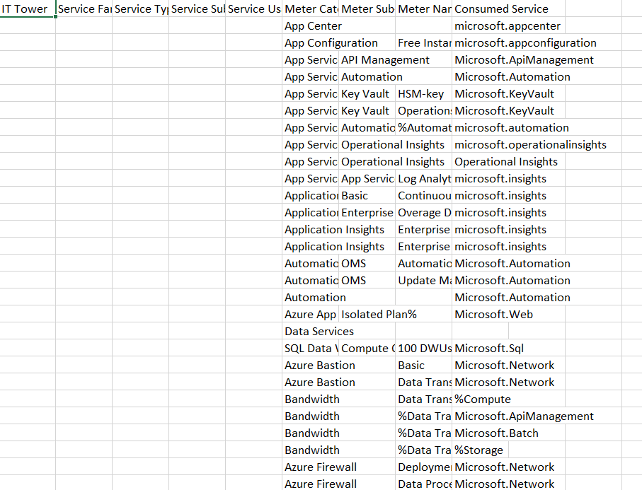

# Лабораторная работа №2 (Azure)

### Цель работы

Знакомство с облачными сервисами. Понимание уровней абстракции над инфраструктурой в облаке. Формирование понимания типов потребления сервисов в сервисной-модели. Сопоставление сервисов между разными провайдерами. Оценка возможностей миграции на отечественные сервисы.

### Дано

1. Слепок данных биллинга от провайдера после небольшой обработки в виде SQL-параметров. Символ % в начале/конце означает, что перед/после него может стоять любой набор символов
2. Google с документациями провайдера

### Описание сервисов 

В таблице встретились несколько сервисов от Azure: Azure App Center, Azure App Configuration, Azure App Service, Azure Application Insights, Azure Automation, Azure Bastion, Azure Firewall, Azure Notification Hubs, Azure Power BI, Azure Site Recovery, Azure Virtual Machines, Azure SQL Data Warehouse.

Попробуем кратко описать каждый из них, а также постараемся найти отечественные аналоги на платформе Yandex Cloud.

#### [Azure App Center](https://azure.microsoft.com/ru-ru/services/app-center/)
Платформа для разработки, тестирования и развертывания мобильных приложений с возможностями непрерывной интеграции, тестирования и обеспечения.
Аналог на Yandex Cloud: [Yandex Cloud Apps](https://cloud.yandex.ru/services/appload-balancer) - сервис для развертывания различных приложений в облаке Yandex.

#### [Azure App Configuration](https://azure.microsoft.com/ru-ru/services/app-configuration/)
Управление конфигурацией приложения в централизованном хранилище, позволяющее динамически изменять параметры приложения без его пересборки.
Аналог на Yandex Cloud: [Yandex Cloud Apps](https://cloud.yandex.ru/services/appload-balancer) - сервис для развертывания различных приложений в облаке Yandex.

#### [Azure App Service](https://azure.microsoft.com/ru-ru/services/app-service/)
Управляемая платформа для развертывания веб-приложений, мобильных бэкэндов и API. Предоставляет высокоуровневые службы для упрощения разработки, развертывания и масштабирования приложений.
Аналог на Yandex Cloud: [Yandex Cloud Apps](https://cloud.yandex.ru/services/appload-balancer) - сервис для развертывания различных приложений в облаке Yandex.

#### [Azure Application Insights](https://azure.microsoft.com/ru-ru/services/monitor/)
Сервис мониторинга и отслеживания производительности приложений, предоставляющий данные о запросах, ошибках и использовании ресурсов.
Аналог на Yandex Cloud: [Yandex Cloud Monitoring](https://cloud.yandex.ru/services/monitoring) - сервис для мониторинга состояния облачных ресурсов и приложений.

#### [Azure Automation](https://azure.microsoft.com/ru-ru/products/automation/)
Сервис для автоматизации управления и конфигурации ресурсов в облаке Azure и локально.
Точный аналог на Yandex Cloud отсутствует, но есть [Yandex Cloud Functions](https://cloud.yandex.ru/services/functions) - сервис для запуска кода без необходимости управления серверами. Также есть [Yandex Resource Manager](https://cloud.yandex.ru/docs/resource-manager/) - сервис для управления ресурсами в облаке Yandex с помощью кода.

#### [Azure Bastion](https://azure.microsoft.com/ru-ru/services/azure-bastion/)
Управляемый сервис, который обеспечивает безопасный доступ к виртуальным машинам в облаке Azure без необходимости публикации публичных IP-адресов.
Аналога в Yandex Cloud нет, но похожий функционал есть внутри [Yandex Compute Cloud](https://cloud.yandex.ru/services/compute) - сервисе для развертывания виртуальных машин в облаке Yandex.

#### [Azure Firewall](https://azure.microsoft.com/ru-ru/services/azure-firewall/)
Управляемая облачная служба для обеспечения безопасности сети, которая защищает ресурсы виртуальной сети Azure.
Аналога на Yandex Cloud нет, но есть [Yandex Cloud Network Security Groups](https://cloud.yandex.ru/docs/vpc/concepts/security-groups) - сервис для управления доступом к ресурсам виртуальной сети. Также похожий функционал есть внутри [Yandex Compute Cloud](https://cloud.yandex.ru/services/compute) - сервисе для развертывания виртуальных машин в облаке Yandex.

#### [Azure Notification Hubs](https://azure.microsoft.com/ru-ru/services/notification-hubs/)
Сервис для рассылки уведомлений в мобильные и другие приложения на популярных платформах.
Именно такого сервиса в Yandex Cloud нет, но есть [Yandex Message Queue](https://cloud.yandex.ru/services/message-queue) - сервис для обмена сообщениями между компонентами приложения, который можно использовать для рассылки уведомлений.

#### [Azure Power BI](https://azure.microsoft.com/ru-ru/products/power-bi/)
Сервис для анализа данных, позволяющий преобразовывать данные в отчеты и визуализации, а также делиться ими с другими пользователями.
Аналог на Yandex Cloud: [Yandex DataLens](https://cloud.yandex.ru/services/datalens) - бесплатный сервис для анализа и визуализации данных без ограничений по количеству пользователей и запросов.

#### [Azure Site Recovery](https://azure.microsoft.com/ru-ru/services/site-recovery/)
Сервис для обеспечения работы приложений при отказах и больших нагрузках, позволяющий создавать резервные копии в облаке Azure и восстанавливать их в случае сбоя.
Аналог на Yandex Cloud: [Yandex Cloud Backup](https://cloud.yandex.ru/services/backup) - сервис для создания резервных копий виртуальных машин в облаке Yandex (это решение только для виртуальных машин, оно не полностью покрывает функционал Azure Site Recovery).

#### [Azure Virtual Machines](https://azure.microsoft.com/ru-ru/services/virtual-machines/)
Сервис, который позволяет легко и быстро развертывать виртуальные машины с различными операционными системами в облаке Azure.
Аналог на Yandex Cloud: [Yandex Compute Cloud](https://cloud.yandex.ru/services/compute) - сервис для развертывания виртуальных машин в облаке Yandex.

#### [Azure SQL Data Warehouse](https://azure.microsoft.com/ru-ru/services/sql-data-warehouse/)
Облачный сервис для аналитики больших данных с использованием технологий SQL, Apache Spark для ускорения работы с данными, а также Azure Data Explorer для анализа потоковых данных.
Аналог на Yandex Cloud: [Managed Service for ClickHouse](https://cloud.yandex.ru/services/managed-clickhouse) - быстрая и масштабируемая облачная аналитическая СУБД.
Также подойдёт [Yandex DataSphere](https://cloud.yandex.ru/services/datasphere) - сервис для ML-разработки, обладающий широкими возможностями для анализа больших данных.

### Сопоставление сервисов

Представим наши размышления в виде таблицы, где в первом столбце будут сервисы Azure, а во втором - сервисы Yandex Cloud, которые мы считаем аналогами.

| Azure | Yandex Cloud |
| ----- | ------------ |
| Azure App Center | `Yandex Cloud Apps` |
| Azure App Configuration | `Yandex Cloud Apps` |
| Azure App Service | `Yandex Cloud Apps` |
| Azure Application Insights | `Yandex Cloud Monitoring` |
| Azure Automation | нет (частично могут подойти `Yandex Cloud Functions`, `Yandex Resource Manager`) |
| Azure Bastion | нет (похожий функционал есть в `Yandex Compute Cloud`) |
| Azure Firewall | нет (похожий функционал есть в `Yandex Cloud Network Security Groups`, `Yandex Compute Cloud`) |
| Azure Notification Hubs | нет (теоретически можно использовать `Yandex Message Queue`) |
| Azure Power BI | `Yandex DataLens` |
| Azure Site Recovery | `Yandex Cloud Backup` |
| Azure Virtual Machines | `Yandex Compute Cloud` |
| Azure SQL Data Warehouse | `Managed Service for ClickHouse`, `Yandex DataSphere` |

Заполним таблицу с исходными данными с учётом этих исследований. Результат [здесь](./result.csv).

### Выводы

В ходе выполнения лабораторной работы были изучены сервисы Azure и найдены их аналоги на платформе Yandex Cloud. Для большинства сервисов Azure в нашем варианте нашлись точные аналоги, но были и такие, для которых не существует замены на Яндекс Облаке (есть похожие сервисы, которые частично повторяют функционал, но некоторые важные возможности отсутствуют). Из этого можно сделать вывод, что дмиграция на Yandex Cloud возможна, но небезопасна и не всегда целесообразна.

