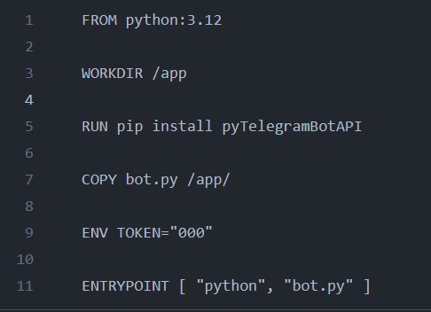

# Лабораторная работа 2
 ТЕСТ ВЕРСИЯ . В РАЗРАБОТКЕ(В НАПИСАНИИ)

### Цель работы
Написать два Dockerfile – плохой и хороший. Описать все плохие практики из кода Dockerfile и почему они плохие, как они были исправлены в хорошем  Dockerfile, а также две плохие практики по использованию этого контейнера

### Telegram bot

За основу в работе с Dockerfile был выбран телграмм-бот.

Телеграм-бот на основе библиотеки Telebot для Python. Бот создается с использованием токена.

### Создание и запуск

Используются для этого две команды:

**docker build -t badbot .** : Эта команда создает Docker-образ, используя текущий каталог (.) в качестве контекста сборки. Флаг -t задает тег для образа, в данном случае он назван "badbot".

**docker run --name badtgbot -e -d badbot**: Эта команда запускает Docker-контейнер на основе образа "badbot". 

А теперь,когда мы знаем, что внутри нашего Dockerfile и какими командами всё это привести в работу, стоит поговорить о самом файле. Плохое и хорошее его исполнение.

### BAD DOCKERFILE

### GOOD DOCKERFILE

### Анализ ошибок в сборке и как они были исправлены
**1.FROM python:latest ---> FROM python:3.12**

Образ с тегом latest всегда представляет собой последнюю доступную версию. Это может привести к неожиданным изменениям в окружении, когда вы запускаете контейнер на разных машинах или в разные моменты времени.
Вместо использования latest рекомендуется явно указывать версию образа (например, python:3.12), чтобы обеспечить стабильность и предсказуемость вашего окружения. Это помогает избежать проблем совместимости и обеспечивает более надежное и предсказуемое развертывание ваших приложений.

**2.ADD ---> COPY**

COPY более явная и простая команда, предназначенная исключительно для копирования файлов и директорий. ADD, с другой стороны, имеет дополнительные функции, такие как автоматическое распаковывание архивов и копирование файлов с удаленных URL, что может быть излишним и даже потенциально опасным в контексте создания Docker-образов.

**3. ENV TOKEN="6963..." ---> ENV TOKEN="000"**

Не стоит ставить какую-то реальную информацию (будь то, например, логин, пароль или тот же токен) как дефолтное значение для переменной окружения (то же касается и ARG). Лучше по дефолту ставить какую-то заглушку, а задавать значение во время запуска докер-контейнера через [-e НАЗВАНИЕ_ПЕРЕМЕННОЙ_ОКРУЖЕНИЯ="ЗНАЧЕНИЕ"]

**4.ENTRYPOINT python bot.py ---> ENTRYPOINT [ "python", "bot.py" ]**

Когда вы используете форму JSON-массива, Docker обрабатывает аргументы внутри контейнера так, как ожидается. Docker будет интерпретировать "python" как исполняемую команду, а "bot.py" как ее аргумент. Это важно для правильного выполнения команды внутри контейнера.

Формат JSON-массива также более совместим с различными оболочками и средами выполнения, что может быть важно при интеграции с другими инструментами и скриптами.

### Вывод

В данной работе мы научились создавать Docker-образы и запускать Docker-контейнеры. Практикуя различные удачные и не удачные варианты для файла поняли, что создание эффективных и безопасных Docker-образов требует внимания к деталям, правильного управления зависимостями, а также учета принципов безопасности и оптимизации при работе с Docker.
